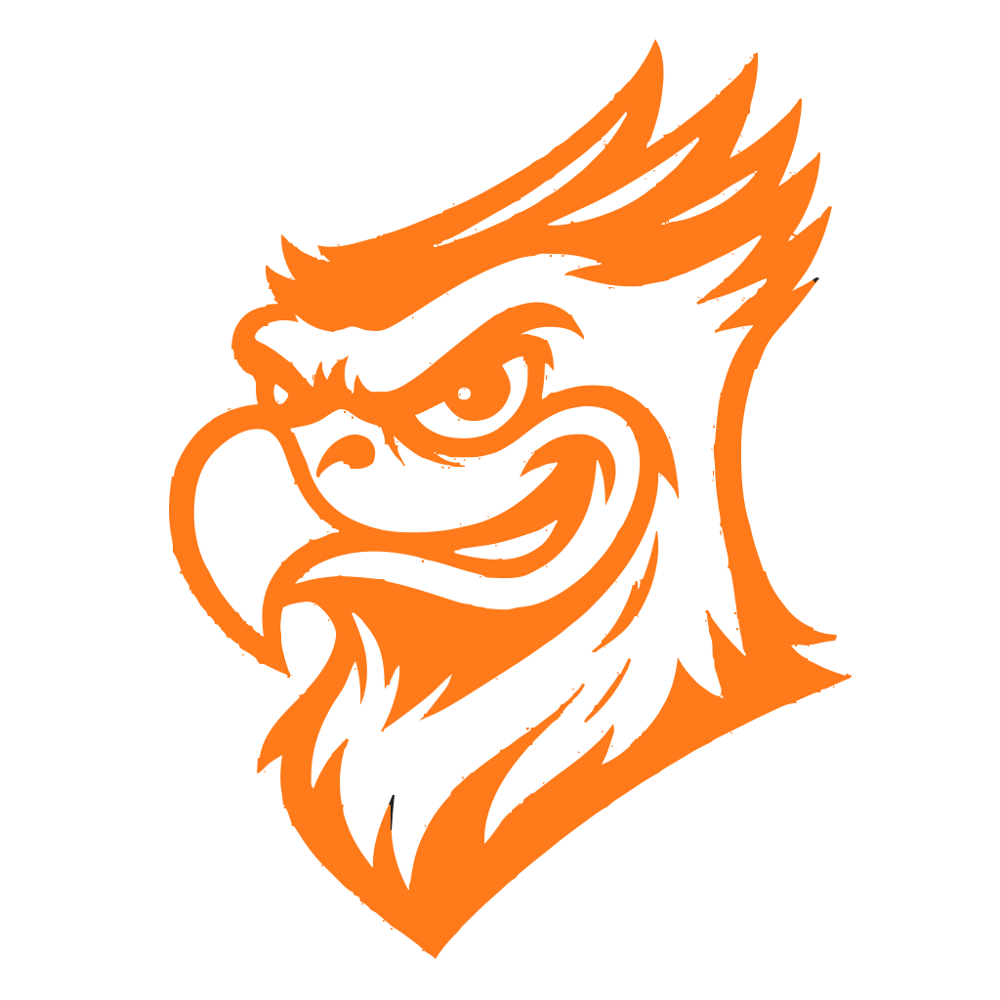

 

 

 

## ▌ Quem somos

A **Optimum Solutions** é a empresa júnior de tecnologia da **Fastech**, criada por estudantes que querem sair da teoria e construir produto de verdade.

> Conectamos times acadêmicos a problemas reais, entregando software sob medida — com processo, qualidade e o ritmo de uma startup.

 

## ▌ Pilares

<table>
<tr>
<td width="25%" align="center">

### 🌐
**Web**

Plataformas, sites institucionais e sistemas internos

</td>
<td width="25%" align="center">

### 📱
**Mobile**

Apps Android/iOS sob medida

</td>
<td width="25%" align="center">

### 🤖
**IA & Automação**

Agentes, automações e dados

</td>
<td width="25%" align="center">

### ☁️
**Infra**

Deploy, nuvem e DevOps

</td>
</tr>
</table>

 

## ▌ Stack

*A stack vai evoluir conforme os projetos chegam.*

 

## ▌ Equipe

| Integrante | GitHub |
|:---:|:---:|
| Claudemir Avelino | [@claudemirmarcelino](https://github.com/claudemirmarcelino) |
| Giuseph Giangareli | [@Giuseph66](https://github.com/Giuseph66) |

 

## ▌ Projetos

<table>
<tr>
<td width="30%" align="center">

</td>
<td>

Desenvolvimento do site oficial da faculdade FastTech.

</td>
</tr>
</table>

 

## ▌ Contato

 

Feito pela equipe <b>Optimum Solutions</b> — Fastech

